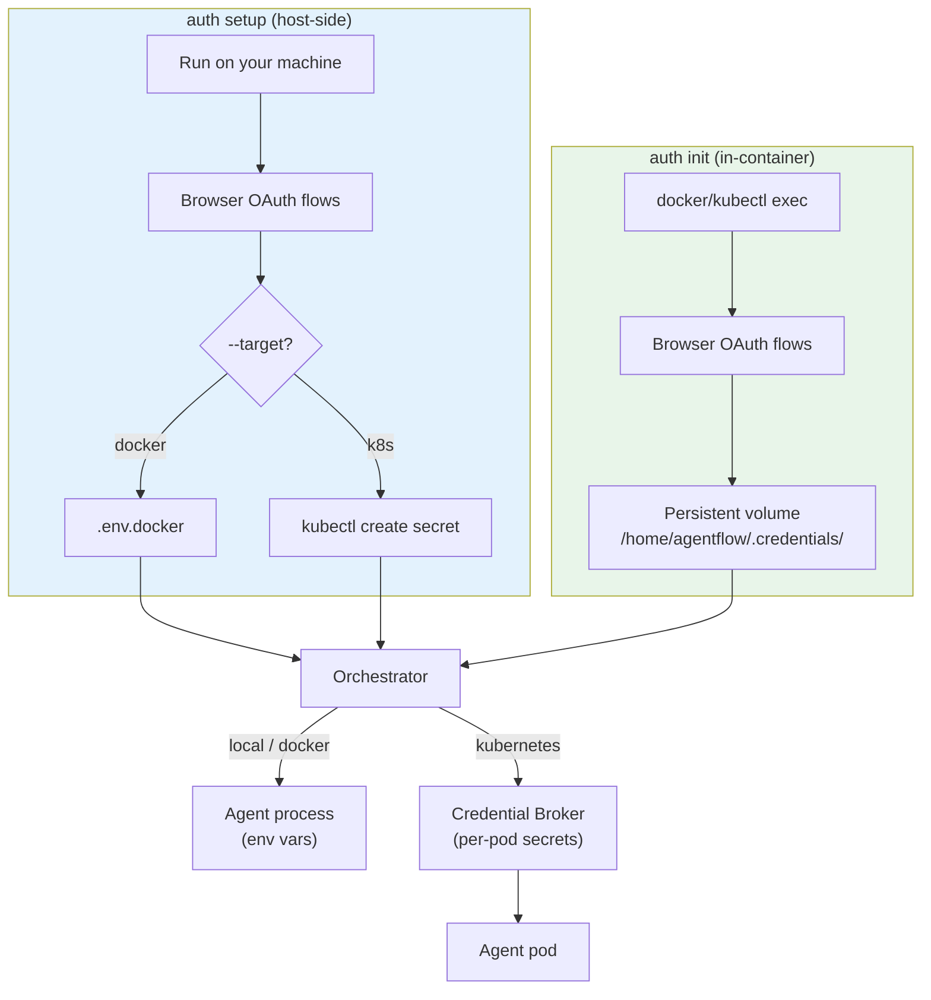
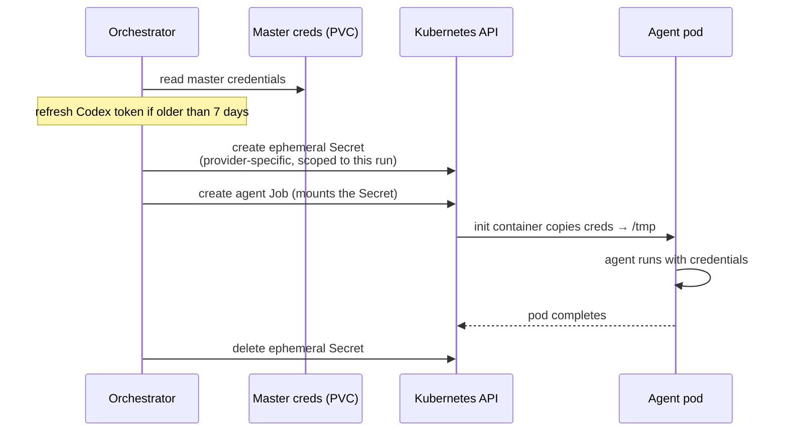

# Authentication

Agentflow needs credentials for AI providers and your work item provider (GitHub or Jira). There are two authentication paths depending on how you deploy.



## Two Auth Paths

### `agentflow auth setup` (Host-Side)

Runs on your machine. Detects providers from your config, runs OAuth flows, and writes credentials to `.env.docker` (Docker Compose) or outputs a `kubectl create secret` command (Kubernetes).

```bash
# Docker Compose target (default)
npx agentflow auth setup --config config/agentflow.yaml

# Kubernetes target
npx agentflow auth setup --config config/agentflow.yaml --target k8s

# Re-authenticate all providers
npx agentflow auth setup --config config/agentflow.yaml --force
```

Best for CI/CD environments or when you prefer host-side credential management.

### `agentflow auth init` (In-Container)

Runs inside the container. Performs OAuth flows and stores credentials on the persistent volume at `/home/agentflow/.credentials/`.

```bash
# Docker Compose
docker exec -it agentflow-orchestrator agentflow auth init

# Kubernetes
kubectl exec -it -n agentflow deployment/agentflow-orchestrator -- agentflow auth init
```

Credentials survive container restarts (Docker named volume / Kubernetes PVC). Recommended for interactive deployments.

!!! warning
    Both commands require an interactive terminal with browser access. They cannot run inside automated pipelines.

## Verifying Credentials

Check the status and expiry of existing credentials:

```bash
npx agentflow auth verify
```

This validates all configured providers and reports token expiry dates.

## Provider Authentication

### Claude

Claude uses OAuth tokens with approximately one year validity.

**Flow:** `claude setup-token` launches a browser-based OAuth flow and returns a long-lived token.

**Credential output:**

- Host-side: `CLAUDE_CODE_OAUTH_TOKEN` written to `.env.docker`
- In-container: token stored in `/home/agentflow/.credentials/`
- Fallback: set `ANTHROPIC_API_KEY` environment variable (API key, not OAuth)

```bash
# Manual auth (outside Agentflow)
claude setup-token
```

### Codex

Codex uses a device authorization flow.

**Flow:** `codex login --device-auth` prints a URL and device code. Open the URL in a browser, enter the code, and authorize.

**Credential output:**

- Host-side: `OPENAI_API_KEY` written to `.env.docker`
- In-container: `auth.json` stored in `/home/agentflow/.credentials/`
- Fallback: set `OPENAI_API_KEY` environment variable

!!! note "Codex token rotation"
    Codex uses single-use refresh tokens — each token refresh invalidates the previous one. In Kubernetes, each agent pod needs independent credentials. The Credential Broker handles this by vending access-token-only credentials to agent pods, preventing refresh token conflicts.

### Gemini

Gemini uses a custom OAuth PKCE flow with the Gemini CLI's public client credentials.

**Flow:** A browser URL is displayed. After authorizing in the browser, paste the authorization code back into the terminal.

**Credential output:**

- Host-side: copies host `~/.gemini/` tokens to `.env.docker`
- In-container: credentials stored in `/home/agentflow/.credentials/`
- Fallback: set `GEMINI_API_KEY` environment variable

Gemini requires three credential files:

| File | Purpose |
|------|---------|
| `oauth_creds.json` | OAuth client credentials |
| `settings.json` | Gemini CLI settings |
| `google_accounts.json` | Google account tokens |

!!! tip
    Gemini access tokens expire after 1 hour but use a reusable refresh token. Read-only mounts work (in-memory refresh), but writable mounts are preferred.

### opencode (Copilot and OpenRouter)

opencode uses stateless, env-var-only authentication. No auth file is written to disk on invocation.

**opencode-copilot** reads `GITHUB_TOKEN` from the environment. Agentflow stores the credential as `GITHUB_COPILOT_TOKEN` so SCM access and Copilot can use different GitHub accounts. At runtime, `OpencodeCliProvider` remaps `GITHUB_COPILOT_TOKEN` to `GITHUB_TOKEN` inside the opencode subprocess.

- Credential: `GITHUB_COPILOT_TOKEN` (OAuth token from `gh auth token`; PATs of any type are rejected by the Copilot API)
- Fallback: if `GITHUB_COPILOT_TOKEN` is absent, opencode inherits `GITHUB_TOKEN` (the SCM token)

**opencode-openrouter** reads `OPENROUTER_API_KEY` from the environment.

- Credential: `OPENROUTER_API_KEY` (`sk-or-v1-...` from openrouter.ai)

Both providers are authenticated via `agentflow auth setup`. See the [opencode setup guide](setup/opencode.md) for full instructions.

## GitHub

GitHub authentication uses a [classic Personal Access Token](https://docs.github.com/en/authentication/keeping-your-account-and-data-secure/managing-your-personal-access-tokens#creating-a-personal-access-token-classic) with the [`repo` scope](https://docs.github.com/en/apps/oauth-apps/building-oauth-apps/scopes-for-oauth-apps#available-scopes).

```bash
# Set in .env.docker or environment
GITHUB_TOKEN=ghp_your_token_here
```

!!! warning "Classic PAT required"
    [Fine-grained PATs](https://docs.github.com/en/authentication/keeping-your-account-and-data-secure/managing-your-personal-access-tokens#fine-grained-personal-access-tokens) do not support the `checks:read` permission needed for the default CI check method (`ci_check_method: "checks"`). Use a **classic PAT** with the `repo` scope. If you must use a fine-grained PAT, set `ci_check_method: "status"` in your repo config and grant the "Commit statuses: Read" permission.

Required scopes depend on the agent role:

| Role | Scopes needed |
|------|---------------|
| Orchestrator | `repo` (CI status reads, label management, PR operations) |
| Developer | `repo` (push, PR creation) |
| Researcher | `repo` (read-only ideally) |
| Reviewer | None (token stripped by default) |

You can assign different tokens per role in the [configuration](configuration.md#github).

## Jira

Jira uses email + API token authentication.

1. Generate an API token at [id.atlassian.com/manage-profile/security/api-tokens](https://id.atlassian.com/manage-profile/security/api-tokens)
2. Set the credentials:

```bash
# In .env.docker or environment
JIRA_EMAIL=you@example.com
JIRA_API_TOKEN=your_api_token
JIRA_BASE_URL=https://myorg.atlassian.net
```

## Credential Broker (Kubernetes)

In Kubernetes, the orchestrator runs a Credential Broker to manage per-pod credentials for agent Jobs. This is automatic — no additional configuration needed beyond the main `credential_secret_name` in [job runner config](configuration.md#job-runner).



The broker:

1. Holds master credentials on the orchestrator's PVC
2. Before spawning each agent pod, creates an ephemeral Kubernetes Secret with provider-specific credentials
3. Mounts the Secret into the agent pod
4. Deletes the ephemeral Secret after the pod completes

Per-provider behavior:

| Provider | Broker strategy | Reason |
|----------|----------------|--------|
| Claude | Env var only | Simple token, no file-based credentials |
| Codex | Access-token-only Secret | Prevents single-use refresh token conflicts across pods |
| Gemini | Full credentials Secret | Reusable refresh token, safe for multi-pod |
| opencode-copilot | Env var only | Stateless env-var auth (`GITHUB_COPILOT_TOKEN`); no auth.json written |
| opencode-openrouter | Env var only | Stateless env-var auth (`OPENROUTER_API_KEY`); no auth.json written |

The broker proactively refreshes Codex tokens when the token age exceeds 7 days.
