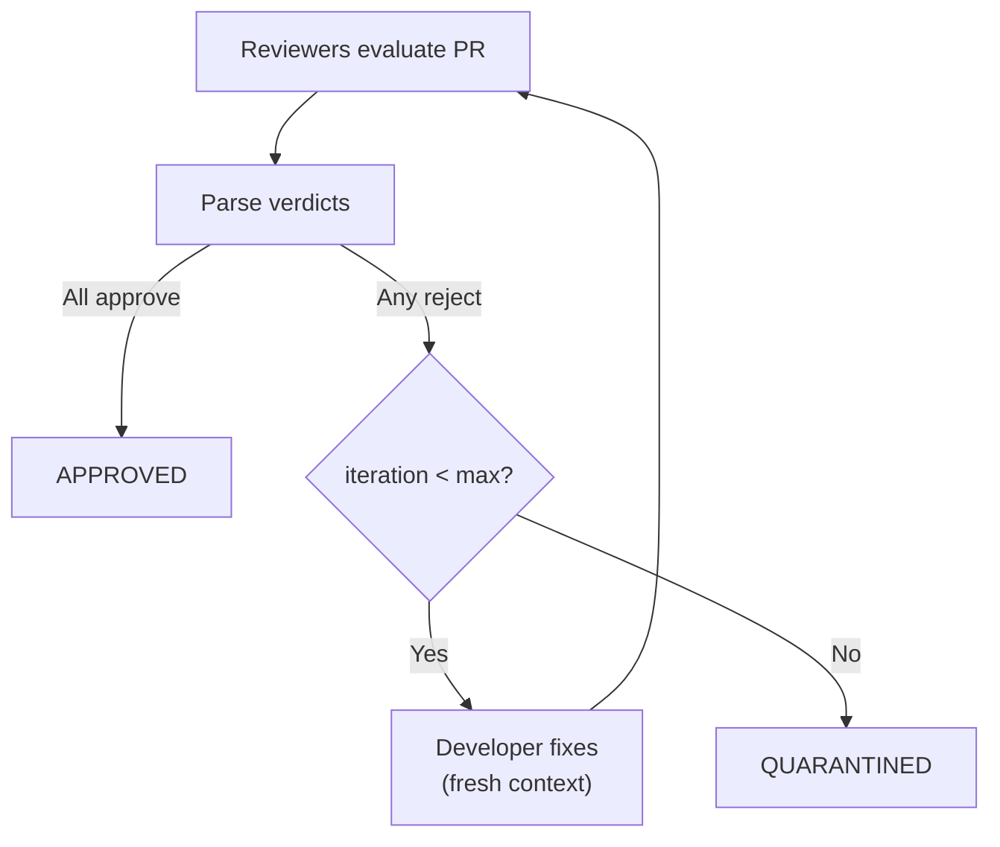

# Review Policies

Agentflow uses configurable review policies to control how pull requests are evaluated before approval.

## Review Dimensions

Each PR is evaluated along one or more dimensions. By default, two are configured:

- **Code Quality** — checks style, tests, security, and best practices
- **Issue Fulfillment** — verifies the PR fully resolves the original issue

Each dimension spawns its own reviewer agent with a fresh context window.

### Custom Dimensions

Add or customize dimensions per repo:

```yaml
repos:
  myproject:
    url: "github.com/org/repo"
    labels: ["agentflow"]
    reviewers:
      dimensions:
        - name: code_quality
          focus: "Pay special attention to SQL injection and XSS vulnerabilities"
        - name: issue_fulfillment
        - name: performance
          focus: "Check for N+1 queries and unnecessary allocations"
          model: "claude-sonnet-4-6"
          provider: "claude"
```

Each dimension supports:

| Field | Description |
|-------|-------------|
| `name` | Dimension identifier (used in verdicts) |
| `focus` | Additional instructions for the reviewer agent |
| `model` | Model override for this dimension |
| `provider` | Provider override for this dimension |

## Consensus Policies

The consensus policy determines when a PR is approved based on individual reviewer verdicts.

```yaml
repos:
  myproject:
    reviewers:
      consensus_policy: all_approve
```

| Policy | Rule | Behavior on tie |
|--------|------|----------------|
| `all_approve` (default) | Every reviewer must approve | N/A |
| `majority_approve` | More than 50% must approve | Tie = `REQUEST_CHANGES` |
| `any_approve` | At least one approval is sufficient | N/A |

### Verdict Parsing

Each reviewer's output is parsed for a binary verdict:

- First non-whitespace token must be `APPROVE` or `REQUEST_CHANGES`
- Malformed or unparseable output defaults to `REQUEST_CHANGES` (fail-safe)

## Iteration Limits

Control how many review cycles are allowed before quarantine:

```yaml
repos:
  myproject:
    reviewers:
      max_review_iterations: 3
      max_reviewer_retries: 1
```

| Setting | Default | Description |
|---------|---------|-------------|
| `max_review_iterations` | `3` | Maximum review → fix → re-review cycles. Exceeded = QUARANTINED. |
| `max_reviewer_retries` | `0` | Retries per reviewer on provider failure (timeout, API error). |

### Review Iteration Flow



On each iteration:

1. All previous approvals are invalidated
2. All reviewers re-evaluate the updated PR (not just the ones that rejected)
3. The iteration counter increments

## CI Failure Limits

Control how many CI failures are allowed before quarantine:

```yaml
repos:
  myproject:
    max_ci_failures: 3
    ci_zero_check_grace_period_s: 120
```

| Setting | Default | Description |
|---------|---------|-------------|
| `max_ci_failures` | `3` | Maximum CI failure retries. Exceeded = QUARANTINED. |
| `ci_zero_check_grace_period_s` | — | Grace period (seconds) when no CI status is set yet |

On CI failure, the developer agent is re-spawned with the failure output as context.

## Architecture Guardian

The Architecture Guardian is an optional review step that enforces architectural rules.

```yaml
repos:
  myproject:
    architecture_guardian:
      enabled: true
      adrs:
        - "https://example.com/adr-001"
        - "https://example.com/adr-002"
      rules:
        - pattern: "packages/core/src/**/*.ts"
          forbidden_imports: ["@agentflow/github"]
          message: "Core package must not import provider-specific code"
        - pattern: "packages/*/src/**/*.ts"
          forbidden_imports: ["node:fs"]
          message: "Use the filesystem abstraction, not direct fs access"
      model: "claude-haiku-4-5-20251001"
      provider: "claude"
```

The guardian:

- Receives the PR diff and configured ADRs
- Checks for import rule violations
- Can veto (REQUEST_CHANGES) even if other reviewers approve
- Uses its own model/provider (typically a fast, cheap model)

## Review Checklist

Provide a custom review checklist that all reviewers receive:

```yaml
repos:
  myproject:
    review_checklist: |
      - [ ] No hardcoded credentials or secrets
      - [ ] Error handling covers all failure modes
      - [ ] New public APIs have documentation
      - [ ] Database migrations are reversible
```

The checklist is included in each reviewer agent's prompt as additional evaluation criteria.

## Agent Prompts

Each agent role uses a built-in prompt template. You can influence agent behavior through configuration without modifying templates directly:

| Lever | Where | Effect |
|-------|-------|--------|
| `context_docs` | repo config | Additional files/URLs injected into research and developer prompts |
| `review_checklist` | repo config | Custom checklist included in reviewer prompts |
| `focus` | reviewer dimension | Extra instructions for a specific review dimension |
| `setup` / `checks` | repo config | Commands the developer agent runs before committing |

For advanced customization, the prompt templates are in `packages/agents/src/prompts/` — one file per role (`research.ts`, `developer.ts`, `reviewer.ts`, `guardian.ts`, `planner.ts`). Modify these for deep behavioral changes.

## Conventions

Agentflow uses fixed conventions for branches, labels, and PRs:

| Convention | Value | Configurable? |
|-----------|-------|---------------|
| Branch naming | `agent/<issue-number>-<slug>` | No |
| PR label | `agent:pr` | No |
| State labels | `agent:claimed`, `agent:in-progress`, etc. | No — same labels used for both GitHub and Jira |
| Jira board projection | `state_mapping` (status per state) | Yes — configurable Jira status per workflow state |
| Merge strategy | `squash` (default) | Yes — `merge_strategy` in repo config |
| Force-push | Disabled | No — never to main/protected branches |
| Max review iterations | 3 | Yes — `max_review_iterations` |
| Max CI failures | 3 | Yes — `max_ci_failures` |

## Token Security

By default, reviewer agents receive no GitHub token — their token is stripped for least-privilege security. Reviewers read the PR diff from the orchestrator context, not by querying GitHub directly.

To override this (not recommended):

```yaml
github:
  tokens:
    reviewer_token_env: "GITHUB_TOKEN_READONLY"
```
