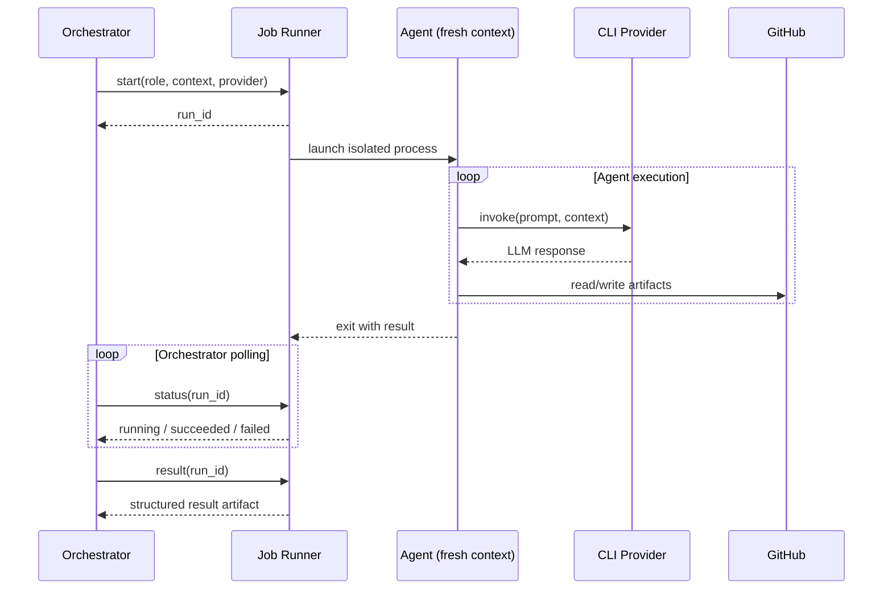

# Agents

Agentflow uses specialized AI agents for each stage of the development pipeline. Each agent gets a fresh context window and communicates only through work item artifacts — never shared memory.

## Agent Types

### Research Agent

Spawned during the RESEARCHING state. Operates in read-only mode.

**Input:** Issue number, title, body, repo URL, context documents

**What it does:**

1. Reads the issue description
2. Explores the codebase to understand relevant code, patterns, and dependencies
3. Reads any linked context documents
4. Produces a structured research summary

**Output:** A comment posted on the work item containing the research summary. This becomes the developer agent's input.

### Developer Agent

Spawned during the IN_PROGRESS state. Has write access to the repository.

**Input:** Issue details, research summary, setup/check commands. On fix iterations: review feedback, CI failure output, or rebase conflict info.

**What it does:**

1. Clones the repository
2. Creates branch `agent/<issue-number>-<slug>`
3. Implements the changes
4. Runs setup commands and checks (if configured)
5. Commits, pushes, and creates/updates the PR

**Output:** A pull request on GitHub.

The developer agent is re-spawned in three fix scenarios:

| Scenario | Additional context provided |
|----------|---------------------------|
| CI failure | CI failure output + failure count |
| Review rejection | Review feedback as structured TODO list + iteration number |
| Merge conflict | Conflicting files + base branch for rebase |

### Reviewer Agents

Spawned in parallel during the IN_REVIEW state. Each reviewer clones the PR branch for full codebase access.

**Input:** Issue details, PR number, PR diff, cloned repository, review dimension, optional checklist

**What they do:**

1. Read the PR diff and browse the full repository for context
2. Evaluate against their assigned dimension
3. Produce a binary verdict: `APPROVE` or `REQUEST_CHANGES` with findings

**Output:** A comment posted on the PR with the verdict (first token) and detailed findings.

Two default dimensions:

- **Code Quality** — style, security, tests, best practices, architectural compliance
- **Issue Fulfillment** — does the PR fully resolve the original issue?

Reviewer agents can be customized with additional dimensions, focus areas, and per-dimension model/provider overrides. See [Review Policies](../customization/policies.md).

### Planner Agent

Optional. Spawned when an issue matches planner criteria (label or body length threshold).

**Input:** Issue details, repo URL

**What it does:** Breaks large issues into sub-issues with dependency ordering.

## Project-Specific Prompts

All agent types support project-specific instructions loaded from Markdown files in the target repository. These are additive — they augment the built-in prompts without replacing them.

For example, a reviewer prompt can instruct the agent to always run `cargo test` before submitting its verdict, or a developer prompt can enforce project-specific coding conventions.

See [Project-Specific Prompts](../customization/project-prompts.md) for configuration and examples.

## AI Providers

Agents interact with AI through CLI tools — never direct API calls. This abstraction allows swapping providers via configuration.

| Provider | CLI Tool | Default Timeout | Notes |
|----------|----------|----------------|-------|
| Claude | `claude` | 300s | OAuth token (~1 year validity) |
| Codex | `codex` | 300s | Device auth flow |
| Gemini | `gemini` | 600s | OAuth PKCE flow, slower execution |

Each provider can be configured with custom arguments, environment variables, and per-role overrides. See [AI Providers](../customization/providers.md).

## Agent Spawning Lifecycle



**Key points:**

- Each `start()` creates a new, isolated process with a fresh context window
- The orchestrator polls asynchronously — it can manage multiple concurrent agent runs
- Results are passed between pipeline steps via `result(run_id)` and work item artifacts
- The Job Runner handles isolation: OS processes (local), containers (Docker), or pods (Kubernetes)

## Spawn Priority

When multiple agents are waiting for a pool slot, the orchestrator does not use simple first-come-first-served ordering. Instead, it prioritizes agents whose tickets are **closest to completion** — finishing near-done work before starting new work.

| Priority | Agent type | When it runs |
|----------|-----------|--------------|
| 1 (highest) | Merge Agent | Approved PR has a merge conflict — one step from done |
| 2 | CI Fix | PR exists, CI failed — needs a quick fix |
| 3 | Review Fix | PR exists, reviewer requested changes |
| 4 | Rebase | PR exists, needs rebase before review |
| 5 (lowest) | Developer | New implementation — furthest from done |

Within the same priority level:

- Tickets with the `prio:high` label are processed before normal-priority tickets
- If both priority level and label are equal, the original queue order (FIFO) is preserved

Spawn priority only controls **ordering** — it never bypasses pool capacity or concurrency limits.

!!! tip "Why this matters"
    Merge agents typically run for 30–60 seconds. Prioritizing them unblocks approved PRs quickly and prevents cascading merge conflicts when multiple tickets are in flight on the same repo. New development tickets experience only a brief delay while near-done work clears.

## Development WIP Limit

When multiple tickets target the same repo, developing them all in parallel creates merge conflicts — each branch diverges from the same base commit, and merging one invalidates the others. The development WIP limit prevents this by controlling how many tickets can be in the **new implementation** phase simultaneously per repo.

```yaml
repos:
  myproject:
    max_concurrent_development: 1  # default
```

With the default of 1, the pipeline becomes a conveyor belt:

1. Ticket A develops on current main, pushes PR, enters CI/review
2. Ticket B starts development on current main (which may already include A's merge)
3. Each developer branches from a main with at most one unmerged PR ahead — conflicts are drastically reduced

**What runs in parallel:** Research, review, CI polling, and all fix/merge agents are unaffected. While ticket A develops, other tickets can be researched and queued. When A's PR enters CI, B starts immediately.

**What is limited:** Only new `developer` agents (new implementation). Fix agents, CI fix agents, rebase agents, and merge agents work on existing branches and are never held back — they don't create new divergence.

!!! example "When to raise the limit"
    Repos with independent modules (e.g., a monorepo where `frontend/` and `backend/` rarely overlap) can set `max_concurrent_development: 2` or higher. This allows parallel development when conflicts are unlikely.

## Provider Failure Handling

If an agent fails due to a transient provider error (timeout, rate limit, API error):

1. The orchestrator retries up to the configured `max_reviewer_retries` (reviewers) or a global retry limit
2. If retries are exhausted, the failure is treated as `REQUEST_CHANGES` with an error note (reviewers) or escalated to FAILED state (other agents)

Logic failures (the agent ran but produced incorrect results) are not retried.
