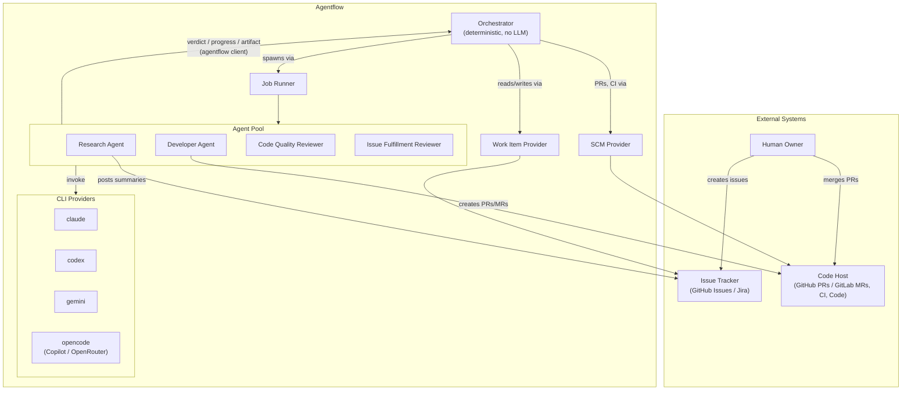
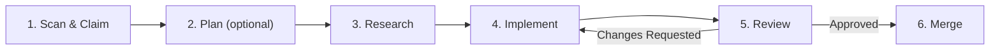
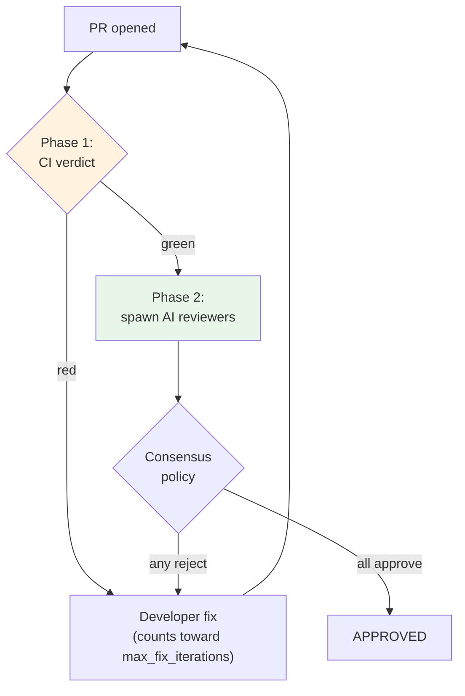

# How It Works

Agentflow is an autonomous software development pipeline. It connects your issue tracker to AI-powered agents that research, implement, and review code changes.

## Architecture

The system consists of:

- **Orchestrator** — a deterministic controller (no LLM) that manages workflow state and spawns agents. It never calls AI providers directly. It exposes an **Agent API** (port 9090) that agents call to report structured results.
- **Work Item Provider** — abstraction over GitHub Issues or Jira. The orchestrator reads and writes work items through this interface.
- **SCM Provider** — abstraction over the code host. GitHub (pull requests) and GitLab (merge requests) are interchangeable per-repo implementations; the orchestrator never calls the GitHub or GitLab API directly.
- **Job Runner** — abstraction for agent execution. Supports local OS processes, Docker containers, and Kubernetes Jobs. It also stages the `agentflow` agent client into each agent's environment at spawn time.
- **CLI Providers** — agents interact with AI through CLI tools (`claude`, `codex`, `gemini`, `opencode`), never direct API calls.

## Pipeline

Each work item flows through six stages (Plan is optional):

### 1. Scan and Claim

The orchestrator polls the issue tracker for actionable work items (matching labels/filters, no unresolved dependencies). When found, it atomically claims the item — setting an `agent:*` label and assignee with a heartbeat TTL to prevent duplicate work. The same labels are used for both GitHub and Jira (stored as GitHub labels or Jira `labels` field respectively).

### 2. Plan (Optional)

If the issue matches planner criteria (configured label or body length threshold), a **Planner Agent** is spawned before research. It breaks the issue into sub-issues with dependency ordering. The orchestrator then processes each sub-issue independently through the remaining pipeline stages.

See [Configuration > Planner Criteria](../configuration.md#planner-criteria).

### 3. Research

A **Research Agent** is spawned with a fresh context window. It:

- Reads the issue description and any linked context documents
- Explores the codebase to understand relevant code
- Produces a structured research summary, posted as a comment on the work item

The research summary becomes the input for the next stage.

### 4. Implement

A **Developer Agent** is spawned with a fresh context (no memory of the research agent's session). It receives the research summary and:

1. Clones the repository
2. Creates a branch (`agent/<issue-number>-<slug>`)
3. Implements the changes
4. Runs local checks (setup commands, lint, test)
5. Commits and pushes
6. Creates or updates a pull request

If CI fails, the orchestrator re-spawns the developer agent with CI failure context. By default the **CI Verdict Gate** is enabled: the CI result is modeled as a verdict and CI must pass before reviewers are spawned. CI failures and review rejections then share a single **unified fix counter** (`max_fix_iterations`, default 5) before quarantine. When the gate is disabled (`ci_verdict_gate: false`), the legacy separate counters apply (`max_ci_failures` and `max_review_iterations`, each default 3). See [Configuration](../configuration.md#ci-and-fix-iterations).

When multiple agents are waiting for a pool slot, the orchestrator prioritizes agents closest to pipeline completion — merge agents before CI fixes, CI fixes before review fixes, and so on. To prevent cascading merge conflicts, new development is limited to one ticket at a time per repo by default (`max_concurrent_development`). See [Agents > Spawn Priority](agents.md#spawn-priority) and [Development WIP Limit](agents.md#development-wip-limit) for details.

### 5. Review

With the CI Verdict Gate enabled (default), review runs in two phases: CI must produce a passing verdict before any AI reviewer is spawned. A red pipeline sends the PR straight back to a developer fix without spending reviewer time on code that doesn't build.

When the gate is disabled (`ci_verdict_gate: false`), reviewers start immediately after the PR opens, in parallel with CI.

**Reviewer Agents** are spawned in parallel, each with a fresh context. By default, two dimensions are evaluated:

- **Code Quality** — style, security, tests, best practices
- **Issue Fulfillment** — does the PR fully resolve the original issue?

Each reviewer submits a binary verdict — `APPROVE` or `REQUEST_CHANGES` — by calling the pre-installed `agentflow` client (`agentflow verdict APPROVE "..."`), which delivers the verdict to the orchestrator as structured data. If a reviewer does not call the client, the orchestrator falls back to parsing the verdict from the first token of stdout; a malformed verdict defaults to `REQUEST_CHANGES` (fail-safe). See [Agents > Agent Client](agents.md#agent-client).

The orchestrator applies the configured consensus policy:

| Policy | Rule |
|--------|------|
| `all_approve` (default) | Every reviewer must approve |
| `majority_approve` | More than 50% must approve (tie = reject) |
| `any_approve` | At least one approval is sufficient |

On rejection, the developer agent is re-spawned with review feedback. Previous approvals are invalidated — all reviewers re-evaluate. This repeats up to the fix-iteration limit before quarantine (the unified `max_fix_iterations`, default 5, when the CI Verdict Gate is enabled; otherwise `max_review_iterations`, default 3).

The optional **Architecture Guardian** can veto a PR independently of the reviewer consensus — it checks import rules and ADR compliance. See [Review Policies > Architecture Guardian](../customization/policies.md#architecture-guardian).

### 6. Merge

After all gates pass (CI verdict + all reviewer verdicts), the next step depends on the repo's `auto_merge` setting:

- **Auto-merge disabled (default):** the orchestrator notifies the human owner. The owner reviews and merges at their discretion. This preserves the human-in-the-loop default.
- **Auto-merge enabled (opt-in):** the orchestrator merges the PR automatically using the configured strategy and notifies the owner informationally. See [Configuration > Auto-Merge](../configuration.md#auto-merge).

After merge, the orchestrator closes the work item and marks it done.

## Fresh Context Per Step

Each pipeline step spawns a **new agent instance** with a fresh context window. Agents don't share memory. All inter-step communication happens through work item artifacts:

- Research summary → issue comment
- Review feedback → PR comment
- CI failure output → agent context

This ensures reproducibility and prevents context window bloat across long-running pipelines.

## Recovery After Restart

If the orchestrator restarts, it reconstructs in-flight state by scanning work items with active labels/statuses:

- Items in `CLAIMED` / `RESEARCHING` / `IN_PROGRESS` — checks heartbeat TTL and reclaims if orphaned
- Items in `PR_OPEN` — resumes CI polling
- Items in `IN_REVIEW` — resumes review polling
- Items in `WAITING_OWNER` — resumes merge polling

Orphaned agent processes (from the crash) finish independently. The orchestrator re-evaluates state from artifacts rather than re-spawning agents unnecessarily.
