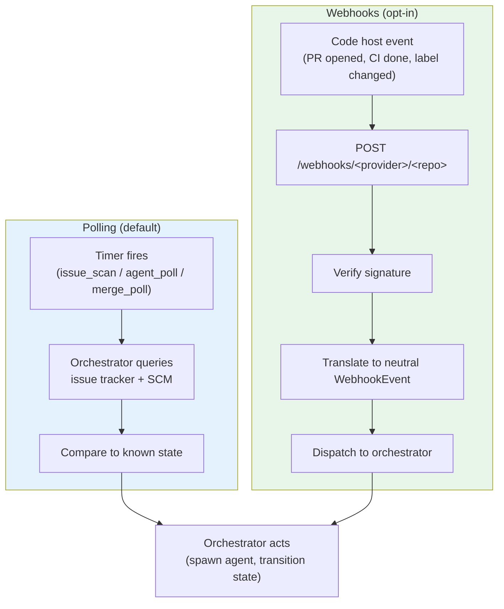

# Webhooks

By default, Agentflow discovers work and detects changes by **polling** — scanning the issue tracker and checking PR/CI status on fixed intervals. Webhooks let the code host push events to Agentflow in real time instead, so the orchestrator reacts within seconds rather than waiting for the next poll cycle.

Webhooks are optional. When enabled, polling is kept as a fallback (its intervals are automatically slowed by 5×), so a missed or undelivered webhook never strands a work item.

## Polling vs Webhooks



With webhooks enabled, the orchestrator subscribes only to a **neutral event stream** — it never sees provider-native payloads. Both GitHub and GitLab events are verified, then translated into the same shape before dispatch.

## Neutral Event Taxonomy

Each verified webhook is normalized to one of these neutral events. Anything outside this set is silently ignored.

| Neutral event | Triggered by |
|---------------|--------------|
| `pr.opened` | PR/MR opened |
| `pr.updated` | New commits pushed to the PR/MR head |
| `pr.reopened` | PR/MR reopened |
| `pr.closed` (`merged: true/false`) | PR/MR merged or closed without merge |
| `pr.review_submitted` | A review verdict (`APPROVE` / `REQUEST_CHANGES`) was submitted |
| `pr.comment_created` | A top-level comment was posted on the PR/MR |
| `pr.label_changed` | A label was added or removed on the PR/MR |
| `issue.opened` | An issue was opened |
| `issue.label_changed` | An issue label was added or removed |
| `ci.completed` | A CI pipeline reached a terminal status |
| `ci.progress` | A CI pipeline reported non-terminal progress |

## Routing

The receiver exposes **one URL per configured repo**, so each repository's webhook is verified with that repo's own settings:

```
POST /webhooks/github/<repoId>
POST /webhooks/gitlab/<repoId>
```

`<repoId>` is the key of the entry in your `repos:` config. A legacy single-endpoint alias (`/webhooks/github`) still works but logs a deprecation warning on every delivery — migrate to the per-repo URL.

## Enabling Webhooks

### 1. Configure Agentflow

```yaml
webhooks:
  enabled: true
  secret: "your-webhook-secret"   # GitHub: shared HMAC secret
```

See [Configuration > Webhooks](../configuration.md#webhooks) for all fields. When enabled, polling intervals are multiplied by 5× automatically — they become a safety net, not the primary trigger.

### 2. Register the webhook on the code host

=== "GitHub"

    In the repository: **Settings → Webhooks → Add webhook**

    - **Payload URL:** `https://<your-orchestrator-host>/webhooks/github/<repoId>`
    - **Content type:** `application/json`
    - **Secret:** the same value as `webhooks.secret`
    - **Events:** Issues, Pull requests, Pull request reviews, Issue comments, Check suites

=== "GitLab"

    In the project: **Settings → Webhooks → Add new webhook**

    - **URL:** `https://<your-orchestrator-host>/webhooks/gitlab/<repoId>`
    - **Secret token** (or HMAC, depending on `webhook_signature` in the repo's `gitlab:` block)
    - **Triggers:** Merge request events, Issues events, Pipeline events, Comments

    GitLab signature scheme is per-repo: `hmac` (HMAC-SHA256 over the body, preferred) or `token` (shared `X-Gitlab-Token`, universally supported). See [Configuration > GitLab repos](../configuration.md#gitlab-repos).

### 3. Verify delivery

Trigger an event (open a PR, add a label) and check the orchestrator log for the dispatched neutral event. Both GitHub and GitLab signature checks use constant-time comparison; an invalid signature is rejected before translation.

## Security

- **Signature verification is mandatory** — every payload is verified before it is parsed. GitHub uses HMAC-SHA256 with `webhooks.secret`; GitLab uses per-repo HMAC or shared-token.
- **Polling remains the source of truth** — webhooks accelerate reaction time but never replace the reconciliation that polling provides. A deployment without webhook ingress works identically, just slower.

## See Also

- [Configuration > Webhooks](../configuration.md#webhooks) — config fields and the polling-interval multiplier
- [Configuration > GitLab repos](../configuration.md#gitlab-repos) — `webhook_signature` per repo
- [Workflow States](workflow-states.md) — what the orchestrator does when an event arrives
