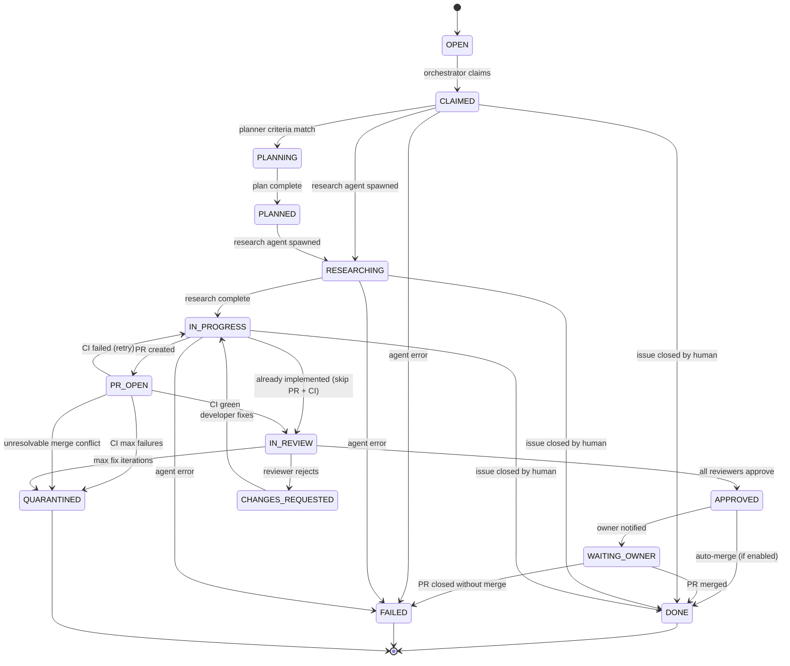

# Workflow States

Agentflow tracks each work item through a series of states, from initial discovery to completion.

## State Diagram

## States

| State | Description | What happens next |
|-------|-------------|-------------------|
| **OPEN** | Work item exists, not yet claimed | Orchestrator scans and claims it |
| **CLAIMED** | Orchestrator has claimed the item (heartbeat TTL active) | Planning (if criteria match) or research agent is spawned |
| **PLANNING** | Planner agent is breaking down the issue | On completion, transitions to PLANNED |
| **PLANNED** | Plan complete, sub-issues created | Research agent is spawned |
| **RESEARCHING** | Research agent is gathering context | On completion, transitions to IN_PROGRESS |
| **IN_PROGRESS** | Developer agent is implementing changes | PR is created → PR_OPEN; or, if the work is already done, → IN_REVIEW (PR and CI skipped, fulfillment reviewer verifies) |
| **PR_OPEN** | PR exists, waiting for CI | CI green → IN_REVIEW; CI red → retry or quarantine |
| **IN_REVIEW** | Reviewer agents are evaluating the PR | Approve → APPROVED; Reject → CHANGES_REQUESTED |
| **CHANGES_REQUESTED** | Review feedback received, developer fixes needed | Developer re-spawned → back to IN_PROGRESS |
| **APPROVED** | All gates passed (CI + reviewers) | Auto-merge if enabled → DONE; otherwise owner is notified |
| **WAITING_OWNER** | PR ready for human merge | Merged → DONE; Closed → FAILED |
| **DONE** | Work item completed | Terminal state |
| **FAILED** | Unrecoverable error occurred | Terminal state |
| **QUARANTINED** | Max retries exceeded (CI or review loop) | Terminal state — needs human triage |

## Label Mapping

Each state maps to exactly one `agent:*` label. The orchestrator removes the previous state label before applying the new one. **The same labels are used for both GitHub Issues and Jira tickets** — labels are the universal source of truth for workflow state.

| State | Label |
|-------|-------|
| OPEN | _(no agent label)_ |
| CLAIMED | `agent:claimed` |
| PLANNING | `agent:planning` |
| PLANNED | `agent:planned` |
| RESEARCHING | `agent:researching` |
| IN_PROGRESS | `agent:in-progress` |
| PR_OPEN | `agent:pr-open` |
| IN_REVIEW | `agent:in-review` |
| CHANGES_REQUESTED | `agent:changes-requested` |
| APPROVED | `agent:approved` |
| WAITING_OWNER | `agent:waiting-owner` |
| DONE | `agent:done` |
| FAILED | `agent:failed` |
| QUARANTINED | `agent:quarantine` |

- **GitHub:** Labels are stored as GitHub issue labels (native label API, auto-created on first use).
- **Jira:** Labels are stored in the Jira `labels` field (free-form text tags, no admin configuration required).

!!! note "Where state lives with GitLab"
    GitLab is an **SCM provider only** — it is not a work-item backend. A `scm: gitlab` repo therefore uses Jira for work items, and the `agent:*` **state** labels live in Jira. On the GitLab side, the orchestrator applies SCM-side labels (e.g. `agent:pr`) to merge requests. Unlike GitHub, GitLab does not auto-create labels, so the orchestrator **pre-creates the `agent:*` label family on each GitLab project at startup** (requires `api` scope).

Additional non-state labels: `agent:pr` (marks Agentflow PRs/MRs), `needs-review`, `needs-owner`.

## Jira Board Projection

When using Jira, the orchestrator also transitions the Jira status on each state change as a **best-effort visual projection** for human board visibility. This keeps the Jira board useful for humans (tickets move across columns), but the Jira status is NOT the source of truth — the `agent:*` labels are.

The `state_mapping` in `agentflow.yaml` controls the projection:

| Agentflow State | Default Jira Status |
|----------------|-------------------|
| OPEN | To Do |
| CLAIMED, PLANNING, PLANNED, RESEARCHING, IN_PROGRESS, PR_OPEN | In Progress |
| CHANGES_REQUESTED | In Progress |
| IN_REVIEW, APPROVED, WAITING_OWNER | In Review |
| DONE, FAILED, QUARANTINED | Done |

Multiple Agentflow states can project to the same Jira status. If the status gets out of sync with labels, the labels win.

**Done-status tickets are excluded from discovery.** Tickets whose Jira board status category is Done are filtered out at the query level and never returned to the orchestrator's scan loop. This prevents re-processing of completed work even when `agent:*` labels have been removed externally (e.g., manual board manipulation or third-party integrations). Reconciliation flows that intentionally inspect terminal items (e.g., to clean up residual artifacts) opt in via a separate query path.

## Terminal States

**DONE** — the work item was completed successfully (PR merged) or the issue was closed by a human during processing.

**FAILED** — an unrecoverable error occurred: agent logic failure, PR closed without merge, or a provider error that exceeded retry limits.

**QUARANTINED** — the work item exceeded a retry limit:

- Fix iterations exceeded the limit. With the CI Verdict Gate enabled (default), CI failures and review rejections share the unified `max_fix_iterations` (default: 5). With the gate disabled, the legacy separate counters apply: `max_ci_failures` (default: 3) and `max_review_iterations` (default: 3). See [Configuration > CI and Fix Iterations](../configuration.md#ci-and-fix-iterations).
- Merge conflict that couldn't be auto-resolved

Quarantined items need human triage. The owner is notified and can either fix the issue manually or remove the label to restart processing.

## Cleanup on Terminal Transitions

When transitioning to a terminal state, the orchestrator removes the issue assignee and deletes the claim comment. This ensures the issue is immediately re-processable if the owner removes the terminal label.
