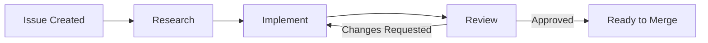

# Agentflow

Agentflow autonomously implements software changes using AI-powered agents. Point it at your issue tracker, and it researches, implements, reviews, and delivers pull requests — ready for human approval.

## Key Features

- **Autonomous pipeline** — from issue to pull request without manual intervention
- **Multi-provider AI** — use Claude, Codex, or Gemini (or mix them)
- **Configurable review loops** — parallel code quality and issue fulfillment reviews
- **Multiple deployment targets** — local process, Docker Compose, or Kubernetes
- **Work item provider agnostic** — GitHub Issues or Jira as your backlog

## How It Works

1. The **Orchestrator** polls your issue tracker for new work items
2. A **Research Agent** gathers context and produces a summary
3. A **Developer Agent** implements the changes and opens a PR
4. **Reviewer Agents** evaluate code quality and issue fulfillment
5. On approval, the PR is ready for human merge

## Next Steps

- [Quick Start](quickstart.md) — get running in under 5 minutes
- [Setup Guides](setup/docker.md) — detailed deployment instructions
- [Configuration](configuration.md) — customize Agentflow for your workflow
